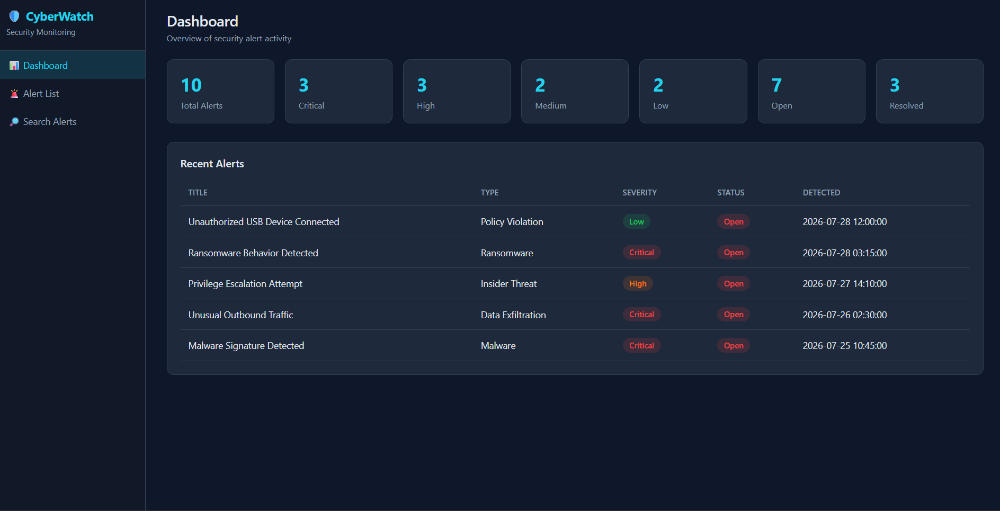
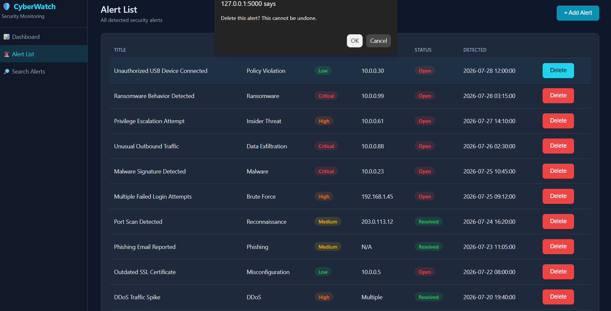
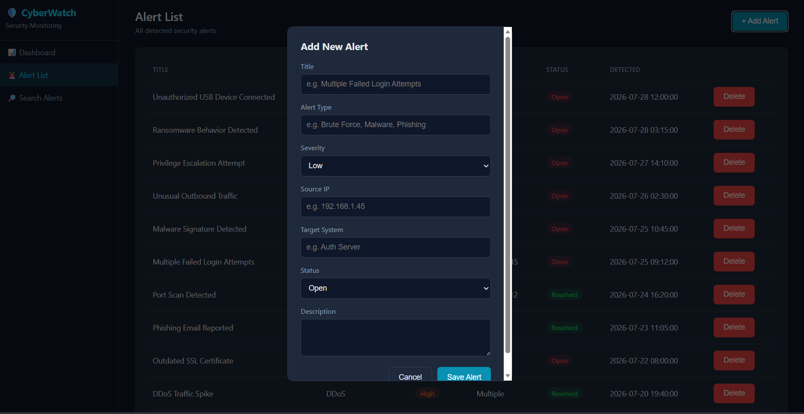
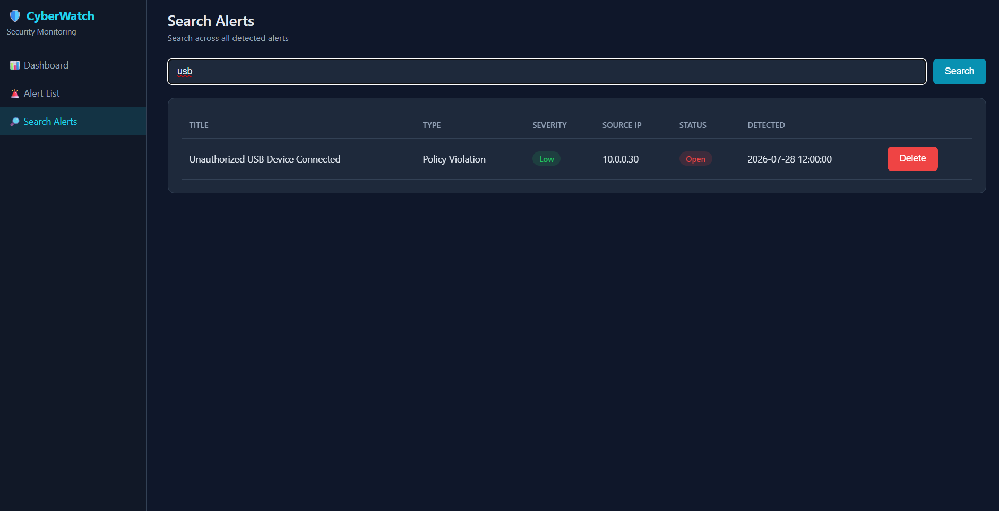

# CyberHawk - Cybersecurity Monitoring Web App

CyberHawk is a lightweight cyber threat monitoring platform built for Smart India Hackathon 2024. It provides a centralized dashboard to view, search, and manage cybersecurity alerts. The project demonstrates REST API development, MongoDB integration, and a clean web interface for handling threat data.

## Tech Stack
- **Backend:** Flask, Python, MongoDB (PyMongo)
- **Frontend:** HTML, CSS, Vanilla JavaScript

## Features
- Dashboard with alert statistics
- View all cybersecurity alerts
- Alert details page
- Search alerts
- Add new alerts
- Delete alerts
- REST API-based backend

## Project Structure

```text
cybersec-monitor/
├── app.py
├── seed_data.py
├── requirements.txt
├── templates/
│   └── index.html
└── static/
    ├── css/style.css
    └── js/app.js
```

## Setup

1. Make sure MongoDB is running locally on `mongodb://localhost:27017`.

2. Create a virtual environment and install dependencies.

```bash
python -m venv venv

# Windows
venv\Scripts\activate

# Mac/Linux
source venv/bin/activate

pip install -r requirements.txt
```

3. Seed dummy alert data.

```bash
python seed_data.py
```

4. Run the application.

```bash
python app.py
```

5. Open your browser and visit:

```
http://localhost:5000
```

## API Endpoints

- `GET /api/alerts`
- `GET /api/alerts/search?q=`
- `GET /api/alerts/<id>`
- `POST /api/alerts`
- `DELETE /api/alerts/<id>`
- `GET /api/dashboard/stats`

## Screenshots

### Dashboard



### Alerts





### Search


